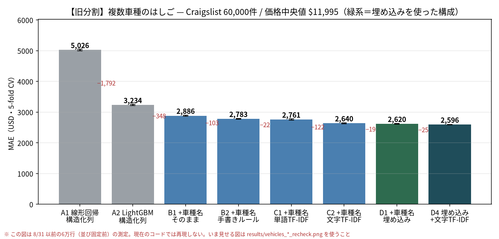
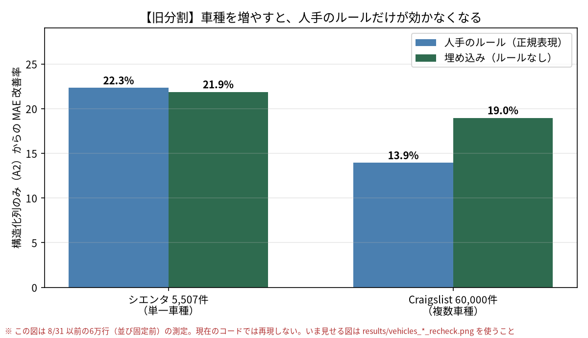
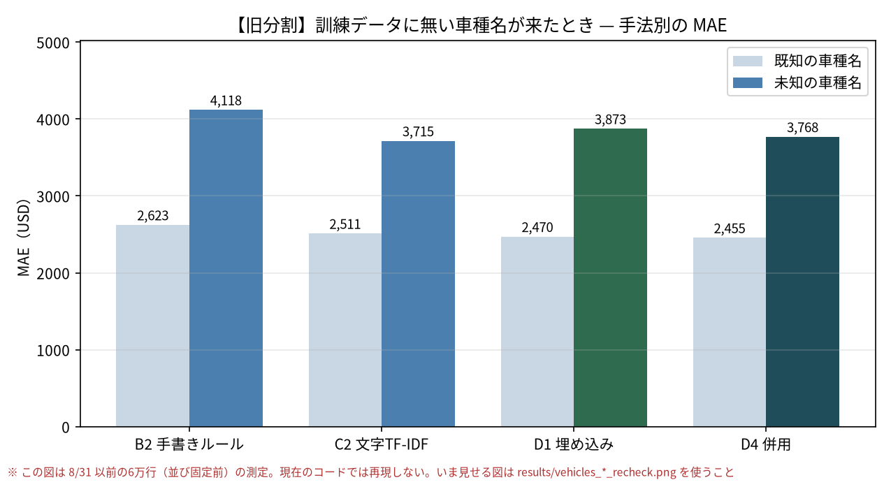

# 複数車種で引き直したベースライン — Craigslist 60,000件（2026-08-29）

> **【9/1 追記】このページの Craigslist の数字と図は、すべて 8/31 以前の6万行のもの。**
> `clean_vehicles.py` が書き出しの並びを固定していなかったため、
> `load_dataset(sample=60_000)` が実行ごとに別の6万行を返していた（9/1 に `ORDER BY 物件ID` で修正）。
> **記録としてはこのまま残すが、現在のコードでは再現しない。**
> 現在の6万行で測り直した図は `results/vehicles_*_recheck.png`
> （→ `docs/2026-09-01-s1-s2-recheck.md`）。人に見せるときはそちらを使うこと。

## なぜやったか

シエンタ（単一車種・5,507件）の検証（→ `2026-08-29-baseline.md`）で、
次の宿題が残っていた。

> 狙うべきはグレード抽出の側。ただしシエンタ単一車種では正規表現で足りてしまう。
> **複数車種に広げると表記が破綻して正規表現が書けなくなる**ので、
> そこが LLM の出番になる。検証するならデータを複数車種に広げる必要がある。

これを Kaggle の Craigslist データ（`vehicles.csv`, 42万件・英語）で実際に確かめた。
問いは1つ。**車種が増えたとき、人手のルールと埋め込みのどちらが強いか。**

対応関係はこうなっている。

| | シエンタ | Craigslist |
|---|---|---|
| 非構造テキストの列 | `タイトル`（グレード名を含む生文） | `model`（車種名の自由記述） |
| 人手で構造を取り出した列 | `グレード名`（正規表現・116水準） | `車種名_ルール正規化`（後述・5,156水準） |
| 種類の数 | 116 | **19,739**（全20万行）／9,611（今回の6万行） |

再現手順:

```bash
.venv/bin/python scripts/clean_vehicles.py            # クレンジング
.venv-embed/bin/python scripts/embed_vehicles.py      # 車種名の埋め込み（約5分）
.venv/bin/python scripts/run_baselines_vehicles.py    # はしご
.venv/bin/python scripts/run_embedding_vehicles.py    # 埋め込みと未知語の分析
.venv/bin/python scripts/plot_vehicles.py             # 作図
```

## 用語（シエンタ編と同じ）

- **MAE（平均絶対誤差）** … 予測が平均で何ドルずれるか。主指標。
  価格中央値が $11,995 なので、MAE 2,620 は約22%の誤差にあたる。
- **R²（決定係数）** … 価格のばらつきのうち何割を説明できたか。1に近いほど良い。
- **5-fold CV（5分割交差検証）** … データを5等分し、4つで学習・1つで答え合わせ、を
  5回繰り返す。全部の行が1度ずつテストに回るので、たまたま当たった／外れたを均せる。
- **TF-IDF** … 文章を「どの単語（または文字の並び）が何回出たか」の数値の列に直す
  古典的な方法。意味は分からないが、辞書もルールも要らない。
- **埋め込み（embedding）** … 学習済みの言語モデルに文章を通し、384個の数値の並びに
  直す方法。「ハイブリッド」と「hybrid」のように字面が違っても近い値になる。
  今回も `intfloat/multilingual-e5-small` を使った（シエンタ編と同じモデル）。

## データの作り方（と、途中で見つかった落とし穴）

`vehicles.csv` 426,880行から、以下で 200,374 行に絞った。

| 段階 | 行数 | 何をしたか |
|---|---:|---|
| 元データ | 426,880 | |
| フィルタ後 | 346,371 | 価格 $1,000〜100,000、年式1990〜2022、走行距離 100〜400,000マイル |
| **重複排除後** | **200,374** | 同じ車の重複出稿を1台1行にまとめた |

### 落とし穴: 42%が重複出稿だった

同じ車が複数の地域に出稿されている。**同一の車台番号（VIN）が最大 261 件**あり、
価格まで同一だった。これを残したままランダムに分割して交差検証すると、
**まったく同じ車が訓練データと答え合わせ用データの両方に入る**。
答えを見てから答えるのと同じことになる。

どれくらい水増しされるかを実測した（`scripts/check_duplicate_leak.py`）。

| | MAE | R² |
|---|---:|---:|
| 重複を残した場合（誤り） | 2,529 | 0.914 |
| 重複排除した場合（正しい） | 2,640 | 0.880 |

MAE で 111ドル（4.2%）、R² で 0.034 だけ良く見えてしまう。
面白いのは**構造化列だけのモデル（A2）ではこの水増しがほとんど起きない**こと
（3,270 vs 3,234）。年式・走行距離だけでは個体を特定できないが、
車種名のテキストが入ると「その1台」を思い出せてしまうためである。
**非構造テキストを特徴量に使うほど、重複排除の手抜きが効いてくる。**

## 結果



60,000行・5-fold CV・価格中央値 $11,995。

| # | 構成 | MAE | MAPE | R² | 前段からの差 |
|---|---|---:|---:|---:|---:|
| 0 | 中央値（予測しない） | 9,280 | 93.5% | −0.09 | — |
| A1 | 線形回帰・構造化列 | 5,026 | 60.5% | 0.685 | −4,254 |
| A2 | LightGBM・構造化列 | 3,234 | 33.0% | 0.834 | −1,792 |
| B1 | + 車種名そのまま（9,611水準） | 2,886 | 30.3% | 0.860 | −348 |
| B2 | + 車種名を手書きルールで正規化 | 2,783 | 29.6% | 0.866 | −103 |
| C1 | + 車種名の単語TF-IDF | 2,761 | 29.4% | 0.869 | −22 |
| C2 | + 車種名の文字TF-IDF | 2,640 | 28.7% | 0.880 | −122 |
| D1 | + 車種名の埋め込み | 2,620 | 28.5% | 0.881 | −19 |
| D2 | D1 の PCA 64次元版 | 2,657 | 28.8% | 0.879 | +37 |
| D3 | 全部乗せ（車種名カテゴリ + 埋め込み） | 2,667 | 29.0% | 0.877 | +47 |
| **D4** | **埋め込み + 文字TF-IDF の併用** | **2,596** | 28.3% | 0.883 | −24（D1比） |
| E | B2 + 説明文（自由記述本体）の単語TF-IDF | 2,616 | 27.1% | 0.881 | −167（B2比） |

「構造化列」＝ 車齢・走行距離・メーカー・状態・気筒数・燃料・名義状態・
変速機・駆動・サイズ・ボディ・色・州。中古車サイトが選択式で持っている項目。

### 手書きルールとは何をしたか

Craigslist の `model` 列は「車種 + グレード + 装備 + 宣伝文」が全部入っている。

```
ford : f-150 raptor arizona raptor*rust free*icon level kit*tech pkg*pano roof
ram  : 2500 slt / quad cab / 4x4 / leather / 5.9 l high output / cummins diesel
bmw  : x5 3.0i awd 126k miles 3.0l v6 pano roof heated leather
```

シエンタでやったのと同じ発想（正規表現で芯だけ抜く）を素直に書くと
「区切り記号（`*` `/` `!` など）以降は宣伝文なので捨て、先頭2語を車種名とみなす」
になる。実際の変換結果:

```
f-150 raptor arizona raptor*rust free*...   → f-150 raptor    ○
2500 slt / quad cab / 4x4 / leather         → 2500 slt        ○
x5 3.0i awd 126k miles 3.0l v6 pano roof    → x5 3            ✕ 排気量の途中で切れた
silverado 1500 crew cab slt                 → silverado 1500  ○
```

9,611 種類が 5,156 種類に整理されたが、`x5 3` のような壊れ方が混ざる。
メーカーごとに書式が違うので、**40社ぶんの規則を書き分けない限り直らない。**
これがシエンタとの決定的な違いで、シエンタは1車種なので `G` `Z` `G クエロ` の
116水準を1本の正規表現で拾いきれていた。

## わかったこと

### 1. 車種を増やすと、人手のルールだけが効かなくなる



価格の単位が違う（万円 / USD）ので、「構造化列だけの LightGBM（A2）から
何%縮んだか」で揃えて比べた。

| | 人手のルール | 埋め込み |
|---|---:|---:|
| シエンタ（単一車種） | −22.3% | −21.9% |
| Craigslist（複数車種） | **−13.9%** | **−19.0%** |

**単一車種では両者は互角だった。複数車種にすると、人手のルールだけが落ちる。**
埋め込みは 19.0% を保ち、単独の手法としては最良（2,620）になった。
シエンタでは埋め込みが最良値を取れなかった（文字TF-IDF の 12.21 に届かなかった）ので、
**順位がひっくり返ったことになる。**

これは仕様書（unfold 機能A）が想定していた状況そのもので、
「非構造テキストを人手のルールなしに型付き列にする」機構の価値は、
**扱う対象の種類が増えるほど大きくなる**ことが実データで確認できた。

ただし差の大きさは正直に見ておく必要がある。D1（2,620 ±8）と C2（2,640 ±16）の差は
19ドルで、5つの fold のうち4つで D1 が勝った程度。**埋め込みは文字TF-IDF に対して
「同等〜わずかに上」であって、圧勝ではない。** 手書きルール（2,783）に対しては
163ドルの差があり、こちらははっきりしている。

### 2. 未知の車種名では、むしろ文字TF-IDF が強い

複数車種にして初めて測れる問いがある。**訓練データに1度も出てこなかった車種名**が
テストに来たときにどうなるか。今回は test 行の 10.7%（6,424行）がこれに当たる。



| 手法 | 全体 | 既知の車種名（89.3%） | 未知の車種名（10.7%） |
|---|---:|---:|---:|
| B2 手書きルール | 2,783 | 2,623 | 4,118 |
| C2 文字TF-IDF | 2,640 | 2,511 | **3,715** |
| D1 埋め込み | 2,620 | 2,470 | 3,873 |
| **D4 併用（埋め込み + 文字TF-IDF）** | **2,596** | **2,455** | 3,768 |

予想では「カテゴリ変数は未知語を欠損としてしか扱えないが、埋め込みは学習済みモデル
なので未知の文字列にもベクトルを出せる。だから未知語で埋め込みが勝つ」だった。
**結果は逆で、未知の車種名では文字TF-IDF の方が 158ドル良い。**

理由は、文字TF-IDF が単語ではなく2〜4文字の並びを見ているため。
`f-250 lariat` が訓練データに無くても、`f-2` `250` `lar` といった断片は
他の行に出ている。つまり文字TF-IDF は未知語を「部分文字列の既知の組み合わせ」に
分解できる。一方 e5-small の埋め込みは文全体を1つのベクトルにするので、
車名という固有名詞そのものを知らないと分解しきれない。

**この2つは競合ではなく補完の関係にある。** D1（埋め込み）が全体で勝っているのは
既知の車種名（89.3%を占める）での差によるもので、未知の10.7%では負けている。

そこで両方を入れたのが D4 で、**MAE 2,596 とはしごの最良値**になった。
既知では埋め込み単独（2,470）をさらに下回る 2,455、未知では埋め込み単独の 3,873 から
3,768 に戻る。**得意分野が違うものを並べると素直に両取りできる**ことが確認できた。
ただし D1 からの改善は 24ドル（0.9%）で、fold のばらつき（±7〜8）よりは大きいものの、
手書きルールとの差（163ドル）に比べれば小さい。

### 3. 自由記述本体（説明文）を足しても、ほとんど伸びない

E は B2（手書きルールで正規化した車種名）に `description` 列
（平均2,972文字の宣伝文）を単語TF-IDF で足したもので、MAE 2,616。
B2 の 2,783 からは 167ドル縮んでいる。
ところがこの 2,616 は、**車種名を文字TF-IDF で入れただけの C2（2,640）とほぼ同じ**である。
3,000文字の宣伝文を丸ごと入れても、20文字の車種名を丁寧に扱うのと差がつかない。
シエンタで「装備テキストを足しても −0.67万円しか動かない」となったのと同じ構図で、
**長い自由記述は、短い車種名がすでに持っている情報の焼き直しが大半。**

なお説明文の埋め込みは今回試していない。6万件×3,000文字を CPU で回すと
数時間かかるため。やるならまず「どの行を LLM に投げるか」を絞る仕組み
（仕様書の adaptive ルーティング）が先に要る、という意味でもある。

## unfold への含意（月曜の論点の更新）

- **機能A（Feature）の価値は複数車種で確認できた。** 単一車種では正規表現に並ぶだけ
  だったが、複数車種では人手のルールを 163ドル（5.9%）上回る。
  「LLM で特徴量を作る意味があるか」への答えは **対象の多様性しだい** で、
  中古車1車種のデモでは価値が見えない。**デモは複数メーカーで作るべき。**
- **超えるべき線は MAE 2,596（D4: 埋め込み + 文字TF-IDF）。** LLM を入れるならここが起点。
- **埋め込み単体では文字TF-IDF に対して圧勝ではない。**
  機能A が「埋め込み → 近傍で分類」だけで終わるなら、文字TF-IDF からの上積みは
  20〜45ドル程度しかない。
  差が出るとすればグレード体系そのものの正規化（`f-150 raptor` と `f150 raptor`
  と `f 150 raptor` を同じ型に落とす）で、そこは LLM の仕事になる。
- **未知語の扱いは設計に明記する必要がある。** 実運用では新車種・新グレードが
  絶えず入ってくる（今回のデータで10.7%）。埋め込みだけの構成はこの層で弱い。
  文字n-gram との併用（D4 で実測: 未知語の MAE が 3,873 → 3,768）、
  あるいは未知語だけ LLM にエスカレーションする
  （＝仕様書の adaptive ルーティングの、confidence ではなく「未知語かどうか」版）
  が現実的な設計になる。
- **重複排除は評価プロトコルの一部として明文化する。** unfold が `fit` / `predict` の
  形で提供されるなら、利用者は素の交差検証を回す。今回のデータでは
  それだけで R² が 0.88 → 0.91 に水増しされた。
- **画像モダリティは Craigslist なら検証できる。** `image_url` が9割の行にある
  （シエンタ側は lazy-load のプレースホルダしか取れていなかった）。
  仕様書の `Feature(source="image")` を試すならこちらのデータ。

## 未着手

- 説明文の埋め込み（計算量の問題。対象行を絞る仕組みとセット）
- 全20万行での再測定（今回は6万行に間引いている。未知語率は 10.7% → 6.4% に下がる）
- LLM を使う構成すべて（機能A の05・機能B）。APIキー待ち
